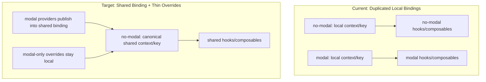

# Deduplicate Hooks Across Modal and No-Modal Packages

## Goal

Deduplicate hook and composable implementations between `packages/modal/` and `packages/no-modal/` as much as possible while keeping runtime behavior and public API stable.

## Non-Negotiable Constraint: Context Identity First

Hooks are bound to the context or injection key they read from. Two hook files can be textually identical and still be non-shareable if they read different React `Context` objects or different Vue `InjectionKey`s.

This means:

1. **Shared context identity first**
2. **Provider rewiring second**
3. **Hook/composable dedupe third**

Type assignability (`Web3Auth extends Web3AuthNoModal`) helps once both providers publish into the same shared context, but it does **not** solve local-context binding by itself.

## Current Duplication

`packages/modal/` and `packages/no-modal/` each currently contain nearly identical sets of:

- **18 React hooks** in `src/react/hooks/`
- **18 Vue composables** in `src/vue/composables/`
- **4 React Solana hooks** in `src/react/solana/hooks/`
- **4 Vue Solana composables** in `src/vue/solana/composables/`
- **3-4 Wagmi files** in `src/react/wagmi/` and `src/vue/wagmi/`

Most of these differ only in import paths and minor behavior drift.

## Root Cause

- **React:** `modal` and `no-modal` each create their own `createContext()` objects, so their hooks are hard-bound to different context identities.
- **Vue:** key sharing is already partly in place, but ownership is inconsistent and the duplicated implementations still drift in behavior.

## Canonical Ownership

- `@web3auth/no-modal` should own the shared hook/composable implementations and the shared context objects.
- `@web3auth/modal` should keep:
  - provider implementations that construct `Web3Auth`
  - modal-only overrides such as `useWeb3Auth` and `useWeb3AuthConnect`
  - provider-level integrations whose lifecycle differs materially, such as `react/solana/provider.ts` and wagmi providers
- Prefer keeping `useWeb3AuthInner` local to each package as a thin wrapper around the shared context object rather than making it a new public API.

## Dedupe Areas

### Area A: React Foundation

- Shared React context objects
- Modal provider rewiring
- Behavior alignment in `no-modal`

### Area B: React Hook Dedupe

- Core React hooks
- React Solana hook files
- Keep modal-only overrides local

### Area C: Vue Foundation

- Validate shared key ownership
- Align behavior in `no-modal`
- Keep provider implementations local in the first pass

### Area D: Vue Composable Dedupe

- Core Vue composables
- Vue Solana composable files
- Keep modal-only overrides local

### Area E: Wagmi

- Treat as a follow-up pass after hook and composable dedupe is stable
- `constants.ts` and `interface.ts` are easier candidates than `provider.ts`

## Keep vs Share Matrix

| Category | Share from `no-modal` | Keep local in `modal` |
| -------- | --------------------- | --------------------- |
| React core | Most hook implementations | `useWeb3Auth`, `useWeb3AuthConnect`, `useWeb3AuthInner`, providers, context provider implementations |
| React Solana | Hook files | `provider.ts` |
| Vue core | Most composable implementations | `useWeb3Auth`, `useWeb3AuthConnect`, `useWeb3AuthInner`, providers |
| Vue Solana | Composable files | `provider.ts`, `useSolanaClient.ts` |
| Wagmi | Possibly `constants.ts` and `interface.ts` later | Providers in the first pass |

## Reviewable Rollout

### Step 0: Review and Stabilize the Current React Context Dedupe

**Goal**

- Review the in-progress context-identity edits before widening the blast radius.

**Files**

- `packages/modal/src/react/context/Web3AuthInnerContext.ts`
- `packages/modal/src/react/context/WalletServicesInnerContext.ts`
- `packages/no-modal/src/react/index.ts`
- `packages/modal/src/react/Web3AuthProvider.ts`
- `packages/modal/src/react/hooks/useWeb3AuthInner.ts`
- `packages/modal/src/react/hooks/useWalletServicesPlugin.ts`

**Checks**

- Confirm the direction is correct: `modal` should publish into the canonical `no-modal` React context objects
- Confirm `Web3Auth` is assignable to the shared context shape because it extends `Web3AuthNoModal`
- Confirm the modal context files still preserve the local import surface for existing modal files
- Do **not** delete hooks or widen the public API in this review step

**Exit criteria**

- The context swap is directionally correct and does not leave modal files importing missing symbols

**Pause**

- Stop here, ask for review, and do not continue until the context-identity direction is approved.

### Step 1: Export the Canonical React Context Objects from `no-modal`

**Goal**

- Make the shared React context identities available through the supported `@web3auth/no-modal/react` entrypoint.

**Files**

- `packages/no-modal/src/react/index.ts`

**Changes**

- Add a named export for `Web3AuthInnerContext` from `./context/Web3AuthInnerContext`
- Add a named export for `WalletServicesContext` from `./context/WalletServicesInnerContext`
- Do **not** export `useWeb3AuthInner` in this step unless a later step proves it is required

**Notes**

- This keeps the public API expansion minimal
- Modal can keep its own thin `useWeb3AuthInner` wrapper while still reading the shared context object

**Pause**

- Stop here, ask for review, and do not continue until the shared export surface is approved.

### Step 2: Keep the Modal React Context Modules as Thin Re-Exports

**Goal**

- Preserve modal's current local import paths while switching the underlying context identity to the shared `no-modal` objects.

**Files**

- `packages/modal/src/react/context/Web3AuthInnerContext.ts`
- `packages/modal/src/react/context/WalletServicesInnerContext.ts`

**Changes**

- Remove modal-local `createContext()` ownership
- Import the shared contexts from `@web3auth/no-modal/react`
- Re-export those same context objects from the modal-local files so existing imports keep working unchanged
- Keep the modal provider implementations local in these files

**Important**

- No hook deletions yet
- No hook re-exports yet
- No provider dedupe yet

**Verification**

- `packages/modal/src/react/Web3AuthProvider.ts`
- `packages/modal/src/react/hooks/useWeb3AuthInner.ts`
- `packages/modal/src/react/hooks/useWalletServicesPlugin.ts`
- All three should continue compiling without changing their import paths

**Pause**

- Stop here, ask for review, and do not continue until the thin re-export pattern is approved.

### Step 3: Verify Modal Provider Wiring Uses the Shared Context Identity

**Goal**

- Ensure the modal React provider tree now publishes into the same context identity that `no-modal` hooks read from.

**Files**

- `packages/modal/src/react/Web3AuthProvider.ts`
- `packages/modal/src/react/context/Web3AuthInnerContext.ts`
- `packages/modal/src/react/context/WalletServicesInnerContext.ts`

**Changes**

- Keep modal's local provider that constructs `new Web3Auth(...)`
- Ensure the provider tree still threads `Web3AuthInnerContext` into `WalletServicesContextProvider`
- Ensure the provider value is typed or widened to the shared `no-modal` context shape where needed

**Non-goals**

- No hook deletions
- No hook barrel changes
- No shared behavior alignment yet

**Pause**

- Stop here, ask for review, and do not continue until the runtime context identity change is approved.

### Step 4: Verify the React Context Foundation Before Sharing Hooks

**Goal**

- Catch build, type, or runtime regressions before any hook dedupe starts.

**Verification**

- Build `packages/no-modal`
- Build `packages/modal`
- Smoke-check one React modal flow
- Confirm modal-only `connect()` behavior still exists
- Confirm modal hooks still work without changing their call sites

**Pause**

- Stop here, ask for review, and do not continue until the React context foundation is green.

### Step 5: Align Shared React Behavior in `no-modal` Part 1

**Goal**

- Fix the smallest shared-behavior drifts before modal inherits them.

**Files**

- `packages/no-modal/src/react/hooks/useAuthTokenInfo.ts`
- `packages/no-modal/src/react/hooks/useWalletServicesPlugin.ts`

**Changes**

- `useAuthTokenInfo`: use the safer dependency and guard behavior
- `useWalletServicesPlugin`: add the missing null-context guard

**Pause**

- Stop here, ask for review, and do not continue until these two shared behavior choices are approved.

### Step 6: Align Shared React Behavior in `no-modal` Part 2

**Goal**

- Finish the remaining React wallet-services behavior alignment before hook sharing.

**Files**

- `packages/no-modal/src/react/hooks/useWalletConnectScanner.ts`
- `packages/no-modal/src/react/context/WalletServicesInnerContext.ts`

**Changes**

- `useWalletConnectScanner`: decide whether loading starts before or after readiness checks and standardize on one version
- `WalletServicesContextProvider`: use `CONNECTED_STATUSES.includes(plugin?.status)` for rehydration-ready detection

**Pause**

- Stop here, ask for review, and do not continue until the wallet-services behavior is approved.

### Step 7: Align Shared React Solana Behavior in `no-modal`

**Goal**

- Make `no-modal` the canonical source of the shared React Solana hook behavior before modal re-exports it.

**Files**

- `packages/no-modal/src/react/solana/hooks/useSolanaWallet.ts`
- `packages/no-modal/src/react/solana/hooks/useSignMessage.ts`

**Changes**

- `useSolanaWallet`: prefer the memoized accounts derivation
- `useSignMessage`: standardize on `WalletInitializationError.notReady()`

**Pause**

- Stop here, ask for review, and do not continue until the shared Solana behavior is approved.

### Step 8: Dedupe React Core Hooks Batch A

**Goal**

- Re-export the lowest-risk modal React hooks first.

**Files**

- `packages/modal/src/react/hooks/index.ts`
- Re-export and then delete:
- `packages/modal/src/react/hooks/useAuthTokenInfo.ts`
- `packages/modal/src/react/hooks/useChain.ts`
- `packages/modal/src/react/hooks/useWeb3AuthDisconnect.ts`
- `packages/modal/src/react/hooks/useWeb3AuthUser.ts`

**Keep local in modal**

- `useWeb3Auth.ts`
- `useWeb3AuthConnect.ts`
- `useWeb3AuthInner.ts`

**Rules**

- Use named re-exports from `@web3auth/no-modal/react`
- Re-export both runtime hooks and companion types where they exist
- Do **not** use `export * from "@web3auth/no-modal/react"`

**Pause**

- Stop here, ask for review, and do not continue until Batch A is approved.

### Step 9: Dedupe React Core Hooks Batch B

**Goal**

- Re-export the next group of read/write hooks after the first batch lands cleanly.

**Files**

- `packages/modal/src/react/hooks/index.ts`
- Re-export and then delete:
- `packages/modal/src/react/hooks/useCheckout.ts`
- `packages/modal/src/react/hooks/useFunding.ts`
- `packages/modal/src/react/hooks/useReceive.ts`
- `packages/modal/src/react/hooks/useSwap.ts`
- `packages/modal/src/react/hooks/useSwitchChain.ts`

**Keep local in modal**

- `useWeb3Auth.ts`
- `useWeb3AuthConnect.ts`
- `useWeb3AuthInner.ts`

**Pause**

- Stop here, ask for review, and do not continue until Batch B is approved.

### Step 10: Dedupe React Core Hooks Batch C

**Goal**

- Re-export the remaining modal React hooks that depend on the now-aligned shared behavior.

**Files**

- `packages/modal/src/react/hooks/index.ts`
- Re-export and then delete:
- `packages/modal/src/react/hooks/useEnableMFA.ts`
- `packages/modal/src/react/hooks/useManageMFA.ts`
- `packages/modal/src/react/hooks/useWalletConnectScanner.ts`
- `packages/modal/src/react/hooks/useWalletServicesPlugin.ts`
- `packages/modal/src/react/hooks/useWalletUI.ts`

**Keep local in modal**

- `useWeb3Auth.ts`
- `useWeb3AuthConnect.ts`
- `useWeb3AuthInner.ts`

**Pause**

- Stop here, ask for review, and do not continue until Batch C is approved.

### Step 11: Dedupe React Solana Hooks

**Goal**

- Share the duplicated React Solana hooks without touching provider lifecycle ownership.

**Files**

- `packages/modal/src/react/solana/hooks/index.ts`
- Re-export and then delete:
- `packages/modal/src/react/solana/hooks/useSignAndSendTransaction.ts`
- `packages/modal/src/react/solana/hooks/useSignMessage.ts`
- `packages/modal/src/react/solana/hooks/useSignTransaction.ts`
- `packages/modal/src/react/solana/hooks/useSolanaWallet.ts`

**Keep local in modal**

- `packages/modal/src/react/solana/provider.ts`

**Pause**

- Stop here, ask for review, and do not continue until the React Solana export surface is approved.

### Step 12: Validate Vue Key Ownership and Align Shared Behavior

**Goal**

- Confirm Vue already has the right shared key identity and clean up the remaining behavior drift before composable dedupe.

**Files**

- `packages/no-modal/src/vue/composables/useWalletServicesPlugin.ts`
- `packages/no-modal/src/vue/WalletServicesInnerProvider.ts`
- Optional follow-up review for `packages/no-modal/src/vue/Web3AuthProvider.ts`

**Context notes**

- `Web3AuthContextKey` is already shared via the string key from `no-modal/base`
- `WalletServicesContextKey` is already exported from `@web3auth/no-modal/vue`
- Vue is therefore closer to dedupe-ready than React, but it still needs behavior alignment

**Changes**

- `useWalletServicesPlugin`: standardize on the modal-style `WalletInitializationError`
- `WalletServicesInnerProvider`: decide whether Vue should mirror React's `CONNECTED_STATUSES.includes(plugin?.status)` rehydration logic
- Re-evaluate whether `connection` should eventually use `shallowRef` in both implementations, but keep provider dedupe out of this pass

**Pause**

- Stop here, ask for review, and do not continue until the Vue behavior choices are approved.

### Step 13: Dedupe Vue Core Composables Batch A

**Goal**

- Re-export the lowest-risk modal Vue composables first.

**Files**

- `packages/modal/src/vue/composables/index.ts`
- Re-export and then delete:
- `packages/modal/src/vue/composables/useAuthTokenInfo.ts`
- `packages/modal/src/vue/composables/useChain.ts`
- `packages/modal/src/vue/composables/useWeb3AuthDisconnect.ts`
- `packages/modal/src/vue/composables/useWeb3AuthUser.ts`

**Keep local in modal**

- `useWeb3Auth.ts`
- `useWeb3AuthConnect.ts`
- `useWeb3AuthInner.ts`

**Pause**

- Stop here, ask for review, and do not continue until Vue Batch A is approved.

### Step 14: Dedupe Vue Core Composables Batch B

**Goal**

- Re-export the next group of modal Vue composables after the first batch lands cleanly.

**Files**

- `packages/modal/src/vue/composables/index.ts`
- Re-export and then delete:
- `packages/modal/src/vue/composables/useCheckout.ts`
- `packages/modal/src/vue/composables/useFunding.ts`
- `packages/modal/src/vue/composables/useReceive.ts`
- `packages/modal/src/vue/composables/useSwap.ts`
- `packages/modal/src/vue/composables/useSwitchChain.ts`

**Keep local in modal**

- `useWeb3Auth.ts`
- `useWeb3AuthConnect.ts`
- `useWeb3AuthInner.ts`

**Pause**

- Stop here, ask for review, and do not continue until Vue Batch B is approved.

### Step 15: Dedupe Vue Core Composables Batch C

**Goal**

- Re-export the remaining modal Vue composables that depend on the now-aligned shared behavior.

**Files**

- `packages/modal/src/vue/composables/index.ts`
- Re-export and then delete:
- `packages/modal/src/vue/composables/useEnableMFA.ts`
- `packages/modal/src/vue/composables/useManageMFA.ts`
- `packages/modal/src/vue/composables/useWalletConnectScanner.ts`
- `packages/modal/src/vue/composables/useWalletServicesPlugin.ts`
- `packages/modal/src/vue/composables/useWalletUI.ts`

**Keep local in modal**

- `useWeb3Auth.ts`
- `useWeb3AuthConnect.ts`
- `useWeb3AuthInner.ts`

**Pause**

- Stop here, ask for review, and do not continue until Vue Batch C is approved.

### Step 16: Dedupe Vue Solana Composables

**Goal**

- Share the duplicated Vue Solana composables while leaving provider ownership alone.

**Files**

- `packages/modal/src/vue/solana/composables/index.ts`
- Re-export and then delete:
- `packages/modal/src/vue/solana/composables/useSignAndSendTransaction.ts`
- `packages/modal/src/vue/solana/composables/useSignMessage.ts`
- `packages/modal/src/vue/solana/composables/useSignTransaction.ts`
- `packages/modal/src/vue/solana/composables/useSolanaWallet.ts`

**Keep local in modal**

- `packages/modal/src/vue/solana/provider.ts`
- `packages/modal/src/vue/solana/composables/useSolanaClient.ts`

**Pause**

- Stop here, ask for review, and do not continue until the Vue Solana export surface is approved.

### Step 17: Wagmi as a Follow-up Pass

**Goal**

- Avoid mixing provider-lifecycle dedupe with hook and composable dedupe in the same pass.

**React wagmi**

- `constants.ts` and `interface.ts` are the likely safe dedupe candidates
- `provider.ts` should be reviewed separately
- `packages/no-modal/src/react/wagmi/index.ts` currently has a different export surface and may need explicit export changes first

**Vue wagmi**

- `constants.ts` and `interface.ts` are also good candidates
- `provider.ts` can stay local in the first pass

**Recommendation**

- Land wagmi in a second PR after the hook and composable dedupe stabilizes

**Pause**

- Stop here, ask for review, and decide explicitly whether wagmi belongs in scope.

### Step 18: Verification and Release Notes

**Goal**

- Catch runtime and type regressions introduced by sharing implementations across packages.

**Minimum verification**

- Build `packages/no-modal`
- Build `packages/modal`
- Smoke-check one React demo flow and one Vue demo flow
- Confirm modal-only `connect()` behavior still exists
- Confirm shared hooks work inside modal providers after context rewiring

**Add coverage**

- Smoke tests for shared hooks and composables under both providers
- Type-level tests for exported hook and composable types
- Changelog note that Solana hook sharing now relies on the base-class API surface from `Web3AuthNoModal`

**Pause**

- Stop here, ask for review, and do not call the rollout complete until verification and notes are approved.

## Behavior Differences To Resolve Before Sharing

| Area | Difference | Proposed source of truth |
| ---- | ---------- | ------------------------ |
| React `useAuthTokenInfo` | Different effect deps and guard behavior | Use the safer modal-style dependency and guard behavior in `no-modal` |
| React `useWalletServicesPlugin` | `no-modal` skips null-context guard | Add the guard in `no-modal` |
| React `useWalletConnectScanner` | Loading and error state order differs | Pick one behavior intentionally before sharing |
| React `useSolanaWallet` | `useState + useEffect` vs `useMemo` for accounts | Use memoized derivation in `no-modal` |
| React `useSignMessage` | Missing-wallet error type differs | Use `WalletInitializationError.notReady()` |
| React `WalletServicesContextProvider` | `CONNECTED` only vs `CONNECTED_STATUSES.includes()` | Use `CONNECTED_STATUSES.includes()` |
| Vue `useWalletServicesPlugin` | Plain `Error` vs `WalletInitializationError` | Use the modal-style Web3Auth error |
| Vue `WalletServicesInnerProvider` | Rehydration readiness logic should match React decision | Mirror the shared React behavior if desired |
| Vue `Web3AuthProvider` | `ref<Connection>` vs `shallowRef<Connection>` | Defer provider unification, but note the difference |

## Risks and Mitigations

### Risk: Hooks look identical but are still bound to local context

**Mitigation**

- Do not share or re-export any hook or composable until the owning provider publishes into the same shared context or key.

### Risk: Accidental public API expansion

**Mitigation**

- Export shared context objects first
- Keep `useWeb3AuthInner` local unless there is a strong reason to publish it

### Risk: Provider lifecycle differences get mixed into the first dedupe

**Mitigation**

- Keep React and Vue provider implementations local in the first pass
- Defer Solana and wagmi provider dedupe

### Risk: No test coverage

**Mitigation**

- Add smoke tests and type-level coverage as part of the rollout, not afterward

## Expected Outcome

**Deleted from `modal` in the first hook/composable pass**

- 14 React core hook files
- 4 React Solana hook files
- 14 Vue core composable files
- 4 Vue Solana composable files

**Kept local in `modal`**

- React: `useWeb3Auth`, `useWeb3AuthConnect`, `useWeb3AuthInner`, provider/context files, `react/solana/provider.ts`
- Vue: `useWeb3Auth`, `useWeb3AuthConnect`, `useWeb3AuthInner`, provider files, `vue/solana/provider.ts`, `useSolanaClient.ts`
- Wagmi providers in the first pass

**Modified in `no-modal`**

- React barrel exports for shared contexts
- Shared React hooks and context behavior
- Shared Vue composable/provider behavior where needed

**Modified in `modal`**

- React and Vue hook/composable barrels become named re-export surfaces
- React providers switch to shared context identity

This version makes **context identity first** the gating condition for every later dedupe step.
